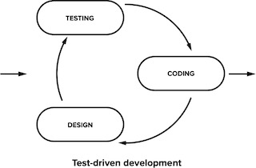
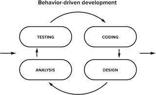

# README

This Rails app follows this article [How to Test Rails Models with RSpec](https://semaphoreci.com/community/tutorials/how-to-test-rails-models-with-rspec#h-what-is-behaviour-driven-development) which should cover the followings:
   1. Using RSpec to test models and business logic.
   2. Applying Continuous Integration with  Semaphore to automate testing

## Questions? Problems?
1. TDD?

   - [Test Driven Development](https://semaphoreci.com/blog/test-driven-development)
   - Test-First Programming
   - allows **short feedback loops** where developers write just the right amount of code and design to make the software work

     

   - [Mocking technique](https://semaphoreci.com/community/tutorials/mocking-with-rspec-doubles-and-expectations)

2. BDD?

   - [Behavior-Driven Development](https://semaphoreci.com/community/tutorials/behavior-driven-development)
   - is a software development process which is about minimizing feedback loop
   - combines general techniques and principles of **Test Driven Development** (TDD)
   - what, not how: We think about what the system does, rather than how it does it.
   - is not UI testing.

     

3. Testing models (Bid, Auction, User)

4. Testing business logic (BiddingEngine)

5. Using CI to automate testing

   - [CI with Semaphore](https://semaphoreci.com/continuous-integration)
   - [CI Pipeline](https://semaphoreci.com/blog/cicd-pipeline)
   - [Dockerizing a RoR app](https://semaphoreci.com/community/tutorials/dockerizing-a-ruby-on-rails-application)

## Appendix

1. Testing Frameworks:

   A. [**Capybara**](https://semaphoreci.com/community/tutorials/integration-testing-ruby-on-rails-with-minitest-and-capybara#what-is-integration-testing): for writing integration tests.
      - an acceptance test framework for webapp.
      - to do end-to-end testing in Rails applications.
      - to simulate a user on a web page and interact with the web page.
      - runs in headless mode by default.

   B. [**Cucumber**](https://medium.com/@enikozsoldos93/cucumber-in-ruby-on-rails-1a4c2561ae54):
      - testing framework
      - allows tester to use Behavior-Driven Development (BDD)
      - to write tests in a natural language syntax.

2. RSpec

   A. [System spec:](https://relishapp.com/rspec/rspec-rails/v/6-0/docs/system-specs/system-spec)
      - wraps around **Rails' System Testing**.
      - uses Capybara under the hood (Capybara gem is automatically required).
      - run with the Selenium driver by default (`driven_by(:selenium)`)
      - `type: :system`
      - runs in a transaction so NO need DatabaseCleaner.

            require "rails_helper"

            RSpec.describe "Post management", type: :system do
               it "creates a new post" do
                  visit new_post_path
                  fill_in "Title", with: "My First Post"
                  fill_in "Body", with: "This is the body of my first post."
                  click_on "Create Post"

                  expect(page).to have_content("Post was successfully created")
                  expect(page).to have_content("My First Post")
                  expect(page).to have_content("This is the body of my first post.")
               end
            end

   B. [Feature spec](https://relishapp.com/rspec/rspec-rails/v/6-0/docs/feature-specs/feature-spec)
      - high-level tests via app's external interface, usually web pages.
      - `type: :feature` (OR set `config.infer_spec_type_from_file_location!` and place files in `spec/features` instead)
      - DSL:
         + `feature` is aliased by `describe`
         + `scenario` is aliased by `it`
      - `RSpec.feature` block defines a feature test

            require "rails_helper"

            RSpec.feature "Visitor creates a post", type: :feature do
               scenario "with valid attributes" do
                  visit new_post_path
                  fill_in "Title", with: "My First Post"
                  fill_in "Body", with: "This is the body of my first post."
                  click_button "Create Post"

                  expect(page).to have_content("Post was successfully created.")
                  expect(page).to have_content("My First Post")
                  expect(page).to have_content("This is the body of my first post.")
               end

               scenario "with invalid attributes" do
                  visit new_post_path
                  fill_in "Title", with: ""
                  fill_in "Body", with: ""
                  click_button "Create Post"

                  expect(page).to have_content("Title can't be blank")
                  expect(page).to have_content("Body can't be blank")
               end
            end

   C. [Request spec:](https://relishapp.com/rspec/rspec-rails/v/6-0/docs/request-specs/request-spec)
      - wraps around **Rails' Integration Testing**.
      - `type: :request` (OR set `config.infer_spec_type_from_file_location!` and place files in `spec/requests` instead)
      - Capybara is NOT supported in request specs

            require "rails_helper"

            RSpec.describe "Post management", type: :request do
               it "creates a new post" do
                  post posts_path, params: { post: { title: "My First Post", body: "This is the body of my first post." } }
                  follow_redirect!

                  expect(response).to have_http_status(:ok)
                  expect(response.body).to include("Post was successfully created")
                  expect(response.body).to include("My First Post")
                  expect(response.body).to include("This is the body of my first post.")
               end
            end

   D. [Controller spec:](https://relishapp.com/rspec/rspec-rails/v/6-0/docs/controller-specs)
      - wraps around **Rails' Functional Testing**.
      - `type: :controller` (OR set `config.infer_spec_type_from_file_location!` and place files in `spec/controllers` instead)

            require "rails_helper"

            RSpec.describe PostsController, type: :controller do
               describe "GET #index" do
                  it "returns a success response" do
                     get :index
                     expect(response).to be_successful
                  end
               end

               describe "GET #show" do
                  it "returns a success response" do
                     post = Post.create!(title: "My First Post", body: "This is the body of my first post.")
                     get :show, params: { id: post.to_param }
                     expect(response).to be_successful
                  end
               end
            end

         Example with Capybara:

            require "rails_helper"

            RSpec.describe PostsController, type: :controller do
               describe "GET #new" do
                  it "renders the new template" do
                     get :new
                     expect(response).to render_template(:new) # delegates to `assert_template` Rails assestion
                  end
               end

               describe "POST #create" do
                  it "creates a new post" do
                     post :create, params: { post: { title: "My First Post", body: "This is the body of my first post." } }
                     expect(response).to redirect_to(post_path(assigns(:post))) # delegates to `assert_redirected_to` Rails assestion
                  end
               end
            end

7. References:

   - [Intro RSpec and Capybara testing](https://rubyyagi.com/intro-rspec-capybara-testing/)
   - [Cucumber](https://medium.com/@enikozsoldos93/cucumber-in-ruby-on-rails-1a4c2561ae54)
   - [Rails Functional Testing](https://guides.rubyonrails.org/testing.html#functional-tests-for-your-controllers)
   - [Rails Integration Testing](https://guides.rubyonrails.org/testing.html#integration-testing)
   - [Rails System Testing](https://guides.rubyonrails.org/testing.html#system-testing)
   - [Mocking with RSpec: Doubles and Expectations](https://semaphoreci.com/community/tutorials/mocking-with-rspec-doubles-and-expectations)
   - [Integration Testing Ruby on Rails with Minitest and Capybara](https://semaphoreci.com/community/tutorials/integration-testing-ruby-on-rails-with-minitest-and-capybara#what-is-integration-testing)